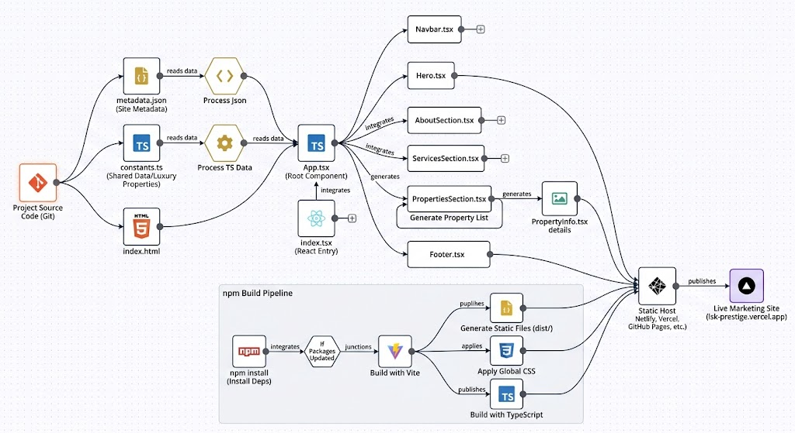

# LSK Prestige Enterprises — Vite + React + TypeScript

A lightweight single-page marketing site built with Vite, React 19, and TypeScript showcasing luxury real estate listings and company information.

**Tech stack:** Vite, React 19, TypeScript, Framer Motion, lucide-react.

## Workflow diagram


## Quick Start

Prerequisites: Node.js (recommended 18+), npm or yarn.

Install dependencies:

```bash
npm install
# or
yarn
```

Run the development server:

```bash
npm run dev
```

Build for production:

```bash
npm run build
```

Preview the production build locally:

```bash
npm run preview
```

The exact npm scripts are taken from `package.json`:

- `dev`: `vite`
- `build`: `vite build`
- `preview`: `vite preview`

## Project Structure

Top-level files:

- `index.html` — HTML entry.
- `index.tsx` — React entry point.
- `App.tsx` — Root application component.
- `vite.config.ts` — Vite configuration.
- `tsconfig.json` — TypeScript configuration.
- `package.json` — Scripts and dependencies.
- `global.css` — Global styles.
- `metadata.json` — Site metadata.
- `constants.ts` — shared data constants (earlier `constants.tsx`).

Key folders:

- `components/` — React components used by the app:
  - `Navbar.tsx` — top navigation.
  - `Hero.tsx` — landing hero section.
  - `AboutSection.tsx` — about the company section.
  - `ServicesSection.tsx` — services offered.
  - `PropertiesSection.tsx` — list of properties.
  - `PropertyInfo.tsx` — detail view for individual property.
  - `FloatingActions.tsx` — floating action buttons.
  - `Footer.tsx` — site footer.
  - `hooks/types.ts` — shared hook types.

- `public/` — static public assets (images, favicon, etc.).

## Components Overview

The app is structured as a simple, component-driven marketing site. Components are small and focused on presentation. Use the `components/` folder as the main place to add or update UI features.

## Development Notes

- Uses React 19 and Vite 6.
- Animations use `framer-motion` and icons use `lucide-react`.
- Routing (if added) can use `react-router-dom` (already present in dependencies).

If you add new packages, update `package.json` and run `npm install`.

## Deployment

Build with `npm run build` and deploy the contents of `dist/` to any static host (Netlify, Vercel, GitHub Pages, Azure Static Web Apps, etc.). For Vercel or Netlify, the default build command is `npm run build` and the publish directory is `dist`.

## Contributing

Feel free to open issues or pull requests. Keep changes focused, add component-level tests where appropriate, and run the dev server locally to verify UI changes.
